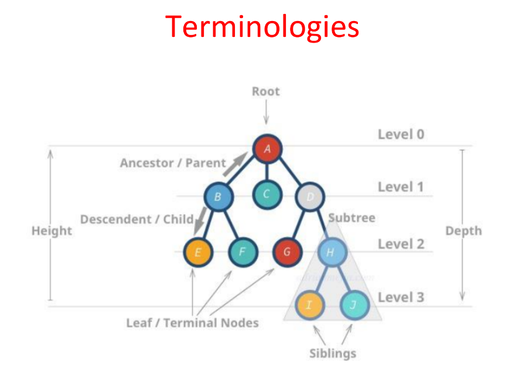

A tree is a non linear data structure that stimulates a hierarchal tree structure with a root value
& sub trees of children w/ parent node, represented as set of linked nodes.

-Root is a special node in a tree, entire tree is referenced through it

-Parent Node = immediate predecessor of a node

-Child Node = immediate successors of a node

-Siblings = Nodes w/ same parent

-Leaf = Last node in tree

-Edge = connection b/w nodes

-Path = num of successive edges from source node -> destination node

**Tree Properties**

-recursive data structure (# of nodes = n)

-edges/links = n-1

-depth of node = # of edges from root to itself

-height of node = #of edges on the longest path b/w that node & a leaf

-height of tree = height of it's root node

**Binary Tree**

-Tree DS that contains nodes with 2 children at most (LC/RC = left/right child)

*Terms & Properties*

-STRICT/PROPER/FULL BT if eah node has 2 or 0 children

-COMPLETE BT if all levels ecept the last are completely filled & all nodes are as left as possible

-max num of nodes at a given level x= 2^x

-max num of nodes 2/height h - 2^(h+1) - 1

-BALANCED BT if diff b/w h of left subtree & right subtree for every node is not more than k (usually k=1)

